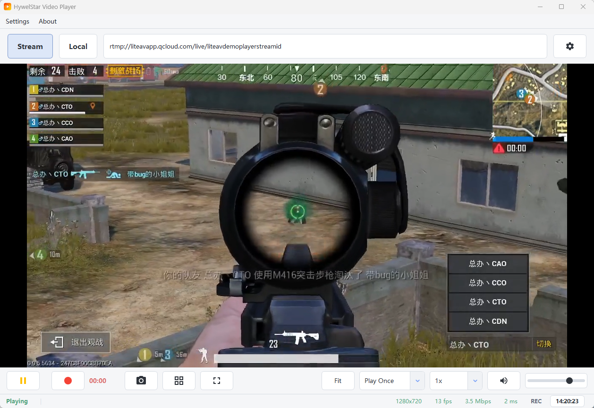

# HywelStar Player

A GStreamer-based video player built with Qt 6, supporting RTSP, UDP, TCP, RTMP, SRT, HLS, DASH, HTTP streams and local video files.



## Development Progress

### Platform Support

| Platform | Status | Notes |
|----------|--------|-------|
| Windows x64 | Done | Qt 6.10 + GStreamer 1.22 |
| Linux x64 | Planned | - |
| macOS | Planned | - |
| Android arm64-v8a | In Progress | GStreamer integration pending |
| Android x86_64 | Planned | For emulator |

### Features

| Feature | Status | Notes |
|---------|--------|-------|
| RTSP Stream Playback | Done | H.264/H.265 |
| UDP Stream Playback | Done | H.264/H.265 |
| TCP Stream Playback | Done | Basic URI support |
| RTMP/RTMPS Playback | Done | Tested with public RTMP stream |
| SRT Playback | Done | URI recognition and playbin3 playback; source validation pending |
| HLS Playback | Done | Tested with HTTPS `.m3u8` |
| MPEG-DASH Playback | Done | Tested with HTTPS `.mpd` |
| HTTP/HTTPS Playback | Done | Progressive streams and MJPEG URLs |
| Local File Playback | Done | MP4, MKV, AVI, etc. |
| Stream/Local Mode Switch | Done | Separate stream URL and local playback workflows |
| Local Playlist | Done | File/folder selection, persisted file list |
| Local Playback Modes | Done | Play Once, Loop One, Loop All |
| Playback Progress Overlay | Done | In-video progress bar with seek, auto-hide |
| Playback Speed Control | Done | 0.5x - 2x |
| Fit/Stretch Display | Done | Aspect fit or stretch toggle |
| Bitrate Display | Done | Local average bitrate and RTSP RTP video bitrate |
| Video Recording | Done | MKV format, local and stream playback recording |
| Screenshot | Done | PNG format |
| Grid Overlay | Done | For positioning |
| Fullscreen Mode | Done | F key / double-click |
| Volume Control | Done | Slider + mute |
| Theme Selection | Done | System, Light, Dark |
| Settings Persistence | Done | Window size, stream URI, volume, mode, loop settings |
| Recording Timer | Done | Real-time display |
| Menu Bar | Done | Top menu |
| Settings Dialog | Done | Recording/Screenshot paths |
| About Dialog | Done | App info |
| Subtitle Support | Planned | SRT, ASS |
| Audio Track Selection | Planned | Multi-track support |
| Hardware Acceleration | Partial | D3D11 on Windows |
| Multi-language UI | Planned | i18n support |

### Known Issues

- [ ] Android GStreamer integration not complete
- [ ] Linux/macOS builds not tested
- [ ] Hardware decoding may not work on all GPUs

## Prerequisites

### Windows

1. **Qt 6.6+**
   - Download from [Qt Online Installer](https://www.qt.io/download-qt-installer)
   - Install MSVC 2022 64-bit kit

2. **GStreamer 1.20+**
   - Download from [GStreamer Downloads](https://gstreamer.freedesktop.org/download/)
   - Install both **Runtime** and **Development** packages (MSVC 64-bit)

3. **Visual Studio 2022** (or Build Tools)
   - Required for MSVC compiler

### Linux (Ubuntu/Debian)

```bash
# Qt 6
sudo apt install qt6-base-dev qt6-tools-dev cmake

# GStreamer
sudo apt install libgstreamer1.0-dev libgstreamer-plugins-base1.0-dev \
    libgstreamer-plugins-good1.0-dev libgstreamer-plugins-bad1.0-dev \
    gstreamer1.0-plugins-ugly gstreamer1.0-libav
```

### macOS

```bash
# Using Homebrew
brew install qt@6 gstreamer gst-plugins-base gst-plugins-good gst-plugins-bad
```

## Build Instructions

### 1) Local Environment Config (Recommended)

Copy local template once, then edit paths for your machine:

```bat
copy env.local.example.bat env.local.bat
```

Build scripts auto-load `env.local.bat` if it exists.

### 2) Windows Build

```bat
build_windows.bat Release
```

Show script help:

```bat
build_windows.bat --help
```

If the output executable is still running, the script attempts to close `HywelStarVideoPlayer.exe` and retry the build once.

### 3) Android Build

```bat
build_android.bat arm64-v8a
```

### 4) Windows Deployment

```bat
deploy_windows.bat Release
```

### 5) Qt Creator (Alternative)

1. Open Qt Creator
2. Open `CMakeLists.txt`
3. Choose your Qt kit
4. Build and run

## Keyboard Shortcuts

| Key | Action |
|-----|--------|
| Space | Play/Pause |
| R | Start/Stop Recording |
| S | Screenshot |
| G | Toggle Grid |
| F | Toggle Fullscreen |
| Esc | Exit Fullscreen |
| Q | Quit |

## Mouse Controls

| Action | Function |
|--------|----------|
| Move over video | Show progress overlay |
| Click video | Play/Pause |
| Drag progress bar | Seek local/media playback |
| Double-click | Toggle fullscreen |

## Playback Modes and Display

- **Stream mode**: enter RTSP/UDP/TCP/RTMP/SRT/HLS/DASH/HTTP/HTTPS URLs in the top bar.
- **Local mode**: select files or folders from the local playlist.
- **Local playback end behavior**: choose Play Once, Loop One, or Loop All.
- **Bitrate display**: local files show average media bitrate; RTSP streams show measured RTP video bitrate when available.
- **Theme**: choose System, Light, or Dark from Settings.

## Tested Stream URLs

| Protocol | Status | URL |
|----------|--------|-----|
| RTSP | Passed | `rtsp://192.168.1.39:8554/video/slamtv60.264` |
| RTMP | Passed | `rtmp://liteavapp.qcloud.com/live/liteavdemoplayerstreamid` |
| HLS | Passed | `https://test-streams.mux.dev/x36xhzz/x36xhzz.m3u8` |
| MPEG-DASH | Passed | `https://dash.akamaized.net/akamai/bbb_30fps/bbb_30fps.mpd` |
| SRT | Pending | Requires a reachable SRT source/server |
| MJPEG | Pending | Use a trusted camera or local MJPEG test service |

## Project Structure

```text
HywelStarPlayer/
|-- CMakeLists.txt          # Build configuration
|-- build_windows.bat       # Windows build script
|-- build_android.bat       # Android build script
|-- deploy_windows.bat      # Windows deploy script
|-- package_portable.bat    # Portable package script
|-- env.local.example.bat   # Local env template
|-- cmake/
|   `-- find-modules/       # CMake find modules
|-- src/
|   |-- main.cpp
|   |-- MainWindow.cpp/h
|   |-- core/               # GStreamer engine, recording
|   |-- ui/                 # UI components and themes
|   |   |-- LocalFileListWidget.cpp/h
|   |   `-- ThemeManager.cpp/h
|   `-- utils/              # Logger, stream parser
|-- resources/
|   |-- resources.qrc
|   `-- icons/
`-- docs/
```

## Technology Stack

- **UI Framework**: Qt 6.6+
- **Video Engine**: GStreamer 1.20+
- **Language**: C++17
- **Build System**: CMake 3.16+

## Changelog

### v1.1.2 (Released 2026-08-02)
- Added tested RTSP, RTMP, HLS, and MPEG-DASH stream coverage notes.
- Improved stream protocol diagnostics for RTMP, SRT, HLS, DASH, HTTP/MJPEG, and HTTPS TLS runtime dependencies.
- Fixed HTTPS HLS playback in portable deployments by packaging GIO TLS modules and setting `GIO_MODULE_DIR`.
- Fixed local and network stream recording startup failures caused by D3D11 memory negotiation.
- Improved recording stability by isolating the recording branch from playback preview backpressure.

### v1.1.1 (Released 2026-08-02)
- Fixed playback volume control and mute/unmute behavior.
- Fixed bitrate reporting for local files and RTSP video streams.
- Added System/Light/Dark theme support and improved dark theme readability.
- Fixed fullscreen playback so the menu bar is hidden in immersive mode.
- Added first-phase stream protocol recognition for RTMP, SRT, HLS, DASH, and MJPEG URLs.

### v1.1.0 (Released 2026-05-08)
- Added Stream/Local mode switching in the top bar.
- Added local file list with file/folder import and persisted playlist.
- Added local playback modes: Play Once, Loop One, Loop All.
- Added in-video progress overlay with seek and auto-hide behavior.
- Added playback speed and fit/stretch display controls.
- Improved fullscreen and video overlay refresh behavior.
- Fixed playback volume control with mute/unmute support and a louder default volume.
- Updated Windows build script with `--help` and automatic retry when the executable is in use.

### v1.0.0 (Released 2026-04-26)
- Basic stream playback (RTSP, UDP, HTTP)
- Video recording and screenshot
- Fullscreen mode with keyboard/mouse support
- Grid overlay
- Settings persistence
- Simplified UI with combined Play/Pause button

## License

MIT License

## Author

hywelstar (hywelstar@163.com)

## Documentation

- Project docs index: docs/README.md
- Windows build guide: docs/WINDOWS_BUILD.md
- Build environments: docs/BUILD_ENVIRONMENTS.md
- Android build guide: docs/ANDROID_BUILD.md
